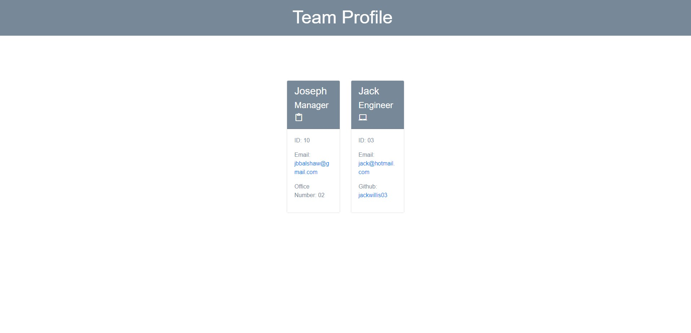

# OOP-JEST-Team-management 
## To manage teams and to show jest functionality 
### Table of Contents
- [Project Discription](#Discription)
- [Useage](#Useage)
- [Installation](#Installation)
- [Contributions](#Constributions)
- [Licence](#Licence)
- [Email](#Questions)
- [github](#Questions)

## Discription
This program when launched it prompts the user to input data about the persona they wish to add to the team.

## Useage 
This program is intended for manages to manage and create groups for work on various projects

## Installation
The program will run when the user launches the code with live server. Before this you will need to run npm install on the command line to install all the dependencies. The user can then use npm run test to check the functionality of the code.

## Contributions 
I am the main contributor.

## Licence 
Not completely sure I need one for this but the following should be good enough.

## Questions 
For any further questions that are not addressed in  this README please find my email and github below

### email: jbbalshaw@gmail.com
### github: 

## ScreenShots

## Video
https://youtu.be/HZSvNBKumLw

